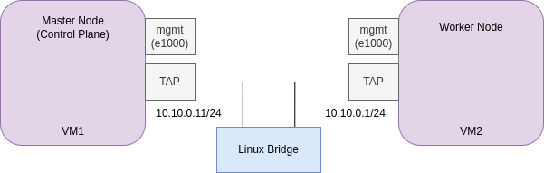

# Deployment of 2 node K8s cluster using kubeadm on QEMU/KVM-based VMs

This testned is based on a 2 node K8s cluster using kubeadm on QEMU/KVM-based VMs. The VMs are running Ubuntu 20.04.



## Instructions

Let's first build the master VM:

```bash
./build.sh vm1 tap
```

This will download for you the ubuntu 20.04 cloud image, create a VM, and install the necessary packages.

Let's ssh into the VM and initialize the master node:

```bash
ssh ubuntu@localhost -p 2021
```

> The credentials are stored in `user-data.yaml`. This file is read by cloud-init when the VM is created.

Inside the vm, clone the repo and run the script for deploying a k8s master node:

```bash
(vm) git clone https://github.com/sergio-gimenez/qemu-kvm-wrapper.git
(vm) qemu-kvm-wrapper/deploy_master_k8s_tesbed.sh
```

This will change your hostaname (likely `ubuntu`) to a new one `master`, and will shutdown the VM.

Now, let's boot again the VM:

```bash
./start.sh vm1 tap
```

And ssh into it:

```bash
ssh ubuntu@localhost -p 2021
```

Inside the vm, run the script to deploy ythe k8s node again:

```bash
(vm) qemu-kvm-wrapper/deploy_master_k8s_tesbed.sh
```

While `vm1` is installing k8s, let's do the same for `vm2`, which will be the worker node.

Let's build the VM `vm2`:

```bash
./build.sh vm2 tap
```

Wait a bit, and ssh into it:

```bash
./build vm2 tap
```

Inside the vm, clone the repo and run the script for deploying a k8s worker node:

```bash
(vm) $ git clone https://github.com/sergio-gimenez/qemu-kvm-wrapper.git
(vm) $ qemu-kvm-wrapper/deploy_worker_k8s_tesbed.sh
```

This will change your hostaname (likely `ubuntu`) to a new one `worker`, and will shutdown the VM.

Now, let's boot again the VM:

```bash
./start.sh vm2 tap
```

And ssh into it:

```bash
ssh ubuntu@localhost -p 2022
```

Inside the vm, run the script to deploy ythe k8s node again:

```bash
(vm) qemu-kvm-wrapper/deploy_master_k8s_tesbed.sh
```

Now, wait till k8s is installed in both VMs.

Meanwhile, in the physical host, let's create a bridge and add the VMs to it:

```bash
./bridge.sh up
```

This will create a bridge called `br0` and attach the VMs to it.

Now, verify there is connectivity between VMs:

```bash
ubuntu@worker:~$ ping 10.10.0.11
PING 10.10.0.11 (10.10.0.11) 56(84) bytes of data.
64 bytes from 10.10.0.11: icmp_seq=1 ttl=64 time=0.901 ms
```

Once the `master` node is installed, you should see the a similar output in `vm1`:

```bash
Your Kubernetes control-plane has initialized successfully!
bla bla...
```

Copy the following command from `master` and run it in `worker` in order to join the cluster:

```bash
sudo kubeadm join 10.10.0.11:6443 --token 32uyzd.pl5cefsxyl4tgzxp \
	--discovery-token-ca-cert-hash sha256:2319a5d256d3207d44ba955754505200da589aa6545316088eeca71e52b6c0b9
```

> Be careful to add `sudo` top the copied command, otherwise it will fail from worker

If everything went well, you should see the following output in `worker`:

```bash
ubuntu@worker:~$ sudo kubeadm join 10.10.0.11:6443 --token 32uyzd.pl5cefsxyl4tgzxp \
> --discovery-token-ca-cert-hash sha256:2319a5d256d3207d44ba955754505200da589aa6545316088eeca71e52b6c0b9
[preflight] Running pre-flight checks
[preflight] Reading configuration from the cluster...
[preflight] FYI: You can look at this config file with 'kubectl -n kube-system get cm kubeadm-config -o yaml'
[kubelet-start] Writing kubelet configuration to file "/var/lib/kubelet/config.yaml"
[kubelet-start] Writing kubelet environment file with flags to file "/var/lib/kubelet/kubeadm-flags.env"
[kubelet-start] Starting the kubelet
[kubelet-start] Waiting for the kubelet to perform the TLS Bootstrap...

This node has joined the cluster:
* Certificate signing request was sent to apiserver and a response was received.
* The Kubelet was informed of the new secure connection details.

Run 'kubectl get nodes' on the control-plane to see this node join the cluster.
```

Also, doublecheck that the nodes are up and running:

```bash
ubuntu@master:~$ kubectl get nodes -o wide
NAME     STATUS     ROLES           AGE   VERSION   INTERNAL-IP   EXTERNAL-IP   OS-IMAGE             KERNEL-VERSION      CONTAINER-RUNTIME
master   NotReady   control-plane   14m   v1.25.3   10.10.0.11    <none>        Ubuntu 20.04.5 LTS   5.4.0-131-generic   containerd://1.5.9
worker   NotReady   <none>          20s   v1.25.3   10.10.0.12    <none>        Ubuntu 20.04.5 LTS   5.4.0-131-generic   containerd://1.5.9

```

