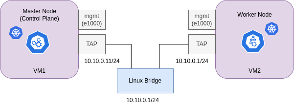

# Deployment of 2 node K8s cluster using kubeadm on QEMU/KVM-based VMs

This testned is based on a 2 node K8s cluster using kubeadm on QEMU/KVM-based VMs. The VMs are running Ubuntu 20.04.



> Note:
> This testbed was designed to be used with the RINA CNI Plugin. However, it can be used with any other CNI plugin, and can be easily adapted to other K8s deployments. To do so, only change the `CNI installation` Section on `deploy_k8s_node.sh`
>
> Note 2:
> The `deploy_k8s_node.sh` script is a bit hardcoded for deploying two nodes. However, it can be easily adapted to deploy more nodes.

## Dependencies

QEMU/KVM. I use a netmap-enabled fork of QEMU/KVM, although netmap is not used in this testbed. However, it's the one I always use:

```bash
git clone https://github.com/netmap-unipi/qemu
cd qemu
./configure --target-list=x86_64-softmmu --enable-kvm --disable-werror --enable-netmap
make
sudo make install
```

## Instructions

Let's first build the master VM:

```bash
./build.sh vm1 tap
```

On another shell start building the worker VM:

```bash
./build.sh vm2 tap
```

This will download for you the ubuntu 20.04 cloud image, create a VM, and install the necessary packages.

Wait a bit until it finishes building the VM and then let's ssh into the VM and initialize the master node:

```bash
VM vm1 has been properly built
You can connect to it with: ssh ubuntu@localhost -p 2021
```

> The credentials are stored in `user-data.yaml`. **This** file is read by cloud-init when the VM is created.

Inside the vm, clone the repo and run the script for deploying a k8s master node:

```bash
git clone https://github.com/sergio-gimenez/qemu-kvm-wrapper.git
qemu-kvm-wrapper/deploy_k8s_node.sh master 1
```

While `vm1` is installing k8s, let's do the same for `vm2`, which will be the worker node.

Like before, inside the vm, clone the repo and run the script for deploying a k8s worker node:

```bash
git clone https://github.com/sergio-gimenez/qemu-kvm-wrapper.git
qemu-kvm-wrapper/deploy_worker_k8s_tesbed.sh
```

Now, wait till k8s is installed in both VMs.

Meanwhile, in the **physical host**, let's create a bridge and add the VMs to it:

```bash
./bridge.sh up
```

This will create a bridge called `br0` and attach the VMs to it.

Now, verify there is connectivity between VMs:

```bash
ubuntu@worker:~$ ping 10.10.0.11
PING 10.10.0.11 (10.10.0.11) 56(84) bytes of data.
64 bytes from 10.10.0.11: icmp_seq=1 ttl=64 time=0.901 ms
```

Once the `master` node is installed, you should see the a similar output in `vm1`:

```bash
Your Kubernetes control-plane has initialized successfully!
bla bla...
```

Copy the following command from `master` and run it in `worker` in order to join the cluster:

```bash
sudo kubeadm join 10.10.0.11:6443 --token 32uyzd.pl5cefsxyl4tgzxp \
	--discovery-token-ca-cert-hash sha256:2319a5d256d3207d44ba955754505200da589aa6545316088eeca71e52b6c0b9
```

> Be careful to add `sudo` top the copied command, otherwise it will fail from worker

If everything went well, you should see the following output in `worker`:

```bash
ubuntu@worker:~$ sudo kubeadm join 10.10.0.11:6443 --token 32uyzd.pl5cefsxyl4tgzxp \
> --discovery-token-ca-cert-hash sha256:2319a5d256d3207d44ba955754505200da589aa6545316088eeca71e52b6c0b9
[preflight] Running pre-flight checks
[preflight] Reading configuration from the cluster...
[preflight] FYI: You can look at this config file with 'kubectl -n kube-system get cm kubeadm-config -o yaml'
[kubelet-start] Writing kubelet configuration to file "/var/lib/kubelet/config.yaml"
[kubelet-start] Writing kubelet environment file with flags to file "/var/lib/kubelet/kubeadm-flags.env"
[kubelet-start] Starting the kubelet
[kubelet-start] Waiting for the kubelet to perform the TLS Bootstrap...

This node has joined the cluster:
* Certificate signing request was sent to apiserver and a response was received.
* The Kubelet was informed of the new secure connection details.

Run 'kubectl get nodes -o wide' on the control-plane to see this node join the cluster.
```

Also, doublecheck that the nodes are up and running:

```bash
ubuntu@master:~$ kubectl get nodes -o wide
NAME     STATUS   ROLES           AGE   VERSION   INTERNAL-IP   EXTERNAL-IP   OS-IMAGE             KERNEL-VERSION      CONTAINER-RUNTIME
master   Ready    control-plane   65s   v1.25.3   10.10.0.11    <none>        Ubuntu 20.04.5 LTS   5.4.0-131-generic   containerd://1.5.9
worker   Ready    <none>          5s    v1.25.3   10.10.0.12    <none>        Ubuntu 20.04.5 LTS   5.4.0-131-generic   containerd://1.5.9
```

<!-- Great, the `control-plane` node now can see the worker node. However, we can see that both nodes are not ready yet (`NotReady` in `STATUS`). This is because there is no CNI installed yet. Let's install the custom RINA CNI Plugin: -->


## Deploying a demo application


In order to deploy the demo, run the following:

```bash
kubectl apply -f rina-cni-plugin/demo/demo.yaml
```

Make sure that all the pods have their IPs:

```bash
ubuntu@master:~$ kubectl get pods -o wide
NAME      READY   STATUS    RESTARTS      AGE   IP           NODE     NOMINATED NODE   READINESS GATES
alpine1   1/1     Running   1 (11m ago)   45m   10.240.0.4   master   <none>           <none>
nginx1    1/1     Running   0             45m   10.240.0.6   master   <none>           <none>
nginx2    1/1     Running   0             45m   10.240.1.2   worker   <none>           <none>
```

And that there is pod-to-pod connectivity in the same node or a remote node:

```bash
ubuntu@master:~$ kubectl exec alpine1 -- ping 10.240.0.6
PING 10.240.0.6 (10.240.0.6): 56 data bytes
64 bytes from 10.240.0.6: seq=0 ttl=64 time=0.304 ms
```

```bash
ubuntu@master:~$ kubectl exec alpine1 -- ping 10.240.1.2
PING 10.240.1.2 (10.240.1.2): 56 data bytes
64 bytes from 10.240.1.2: seq=0 ttl=62 time=2.332 ms
```
